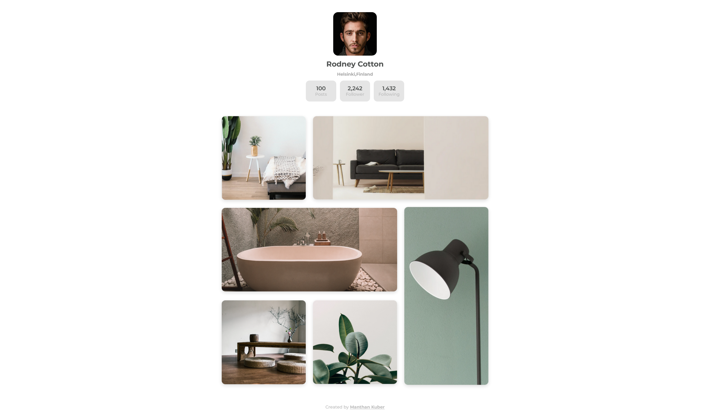
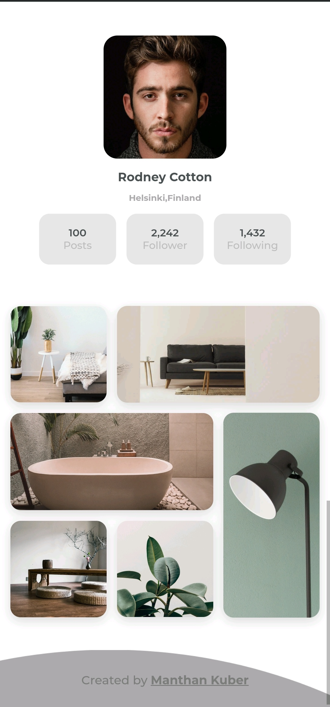

<!-- Please update value in the {}  -->

<h1 align="center">My Gallery Page</h1>

   Solution for a challenge from  <a href="http://devchallenges.io" target="_blank">Devchallenges.io</a>.

  <h3>
    <a href="https://manthan-kuber.github.io/my-gallery-page/">
      Live Demo
    </a>
     | 
    <a href="https://devchallenges.io/challenges/gcbWLxG6wdennelX7b8I">
      Challenge
    </a>
  </h3>

<!-- TABLE OF CONTENTS -->

## Table of Contents

- [Overview](#overview)
- [Learnings](#learnings)
- [Contact](#contact)

<!-- OVERVIEW -->

## Overview

Desktop Screenshot

Mobile Screenshot

This application/site was created as a submission to a [DevChallenges](https://devchallenges.io/challenges) challenge. The [challenge](https://devchallenges.io/challenges/OEKdUZ6xs0h99C38XVht) was to build an application to complete the given user stories.

## Learnings

- Improved overall layout and positioning skills
- Improved Grid layout skills
- Got comfortable with using min,clamp and other modern css practices
- Made the page fully responsive almost without using a single media query(used a media query to alter grid gap. But thats it)

## Contact

- GitHub [@Manthan-Kuber](https://github.com/Manthan-Kuber)
